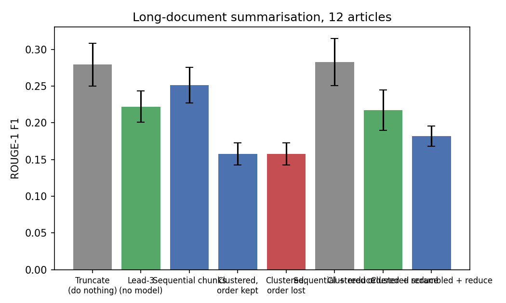

# Does clever chunking beat just truncating the document?


A summarisation model reads 1,024 tokens. The articles here are longer than that. Five
strategies for deciding what goes inside the window, compared with ROUGE on 12
CNN/DailyMail articles that all overflow it.

```bash
pip install -e ".[dev]"
pytest -q                                    # no model needed
pip install -e ".[transformer]"
python -m longsum.study                      # downloads the model, ~8 minutes on CPU
```

## Results

| Strategy | ROUGE-1 | ROUGE-L | Chunks | Words out | vs sequential [95% CI] |
| --- | --- | --- | --- | --- | --- |
| Sequential + reduce | **0.283** | 0.206 | 2.0 | 46 | +0.032 [+0.002, +0.061] |
| Truncate (do nothing) | 0.279 | **0.213** | 1.0 | 44 | +0.028 [+0.009, +0.047] |
| Sequential chunks | 0.251 | 0.177 | 2.0 | 91 | baseline |
| Lead-3 (no model) | 0.222 | 0.168 | 0 | 80 | −0.029 [−0.081, +0.023] |
| Clustered ordered + reduce | 0.217 | 0.147 | 5.2 | 51 | −0.034 [−0.075, +0.007] |
| Clustered scrambled + reduce | 0.182 | 0.140 | 5.2 | 50 | −0.069 [−0.111, −0.027] |
| Clustered, order kept | 0.158 | 0.107 | 5.2 | 227 | −0.094 [−0.137, −0.050] |
| Clustered, order lost | 0.158 | 0.108 | 5.2 | 227 | −0.094 [−0.137, −0.050] |



**Throwing the overflow away scores as well as any of the machinery.** Truncation takes
2.6 seconds and matches the best pipeline; semantic clustering takes five times longer
and scores worse. On news writing that is not surprising once said out loud — the story
is in the opening paragraphs, so the part that gets discarded is the part that matters
least. It is still the result the elaborate version has to beat, and it did not.

## Two ways this experiment nearly lied

The study was built to test whether scrambling sentence order hurts. Getting an answer
took fixing the experiment twice, and both fixes are the interesting part.

**1. The metric could not see the manipulation.** On raw output the ordered and
scrambled variants score *exactly* the same — +0.000 with a zero-width interval. That is
arithmetic, not a finding: ROUGE-1 counts unigrams, so joining the same chunk summaries
in a different order cannot change it. There is a test pinning this property. Any
ordering experiment scored on ROUGE-1 measures nothing by construction.

**2. A confound buried the effect.** Clustering produces 5.2 chunks against sequential
chunking's 2.0, so its final text runs to 227 words against 91, and ROUGE F1 punishes
length through precision. The strategies were being compared on output length, not on
method. Adding a reduce pass — summarise the joined chunk summaries once more — puts
every strategy at roughly 50 words, and only then does the comparison mean anything.

With both fixed, ordered clustering beats scrambled by **+0.035 ROUGE-1, CI [−0.012,
+0.082]**. That interval includes zero on 12 documents, so the honest word is
*suggestive*, not *established*.

A third flaw was caught by a test rather than by the results: the budget-splitting step
sorted sentences when it split an oversized cluster, quietly handing the scrambled
variant its order back. `enforce_budget(..., sort_within=False)` exists because of it.

## What's here

```
src/longsum/
  rouge.py       ROUGE-1/2/L written out, including the LCS, so the definition is visible
  chunking.py    sentence splitting and token-budget chunking, returning indices not text
  strategies.py  truncate, lead-3, sequential, clustered (order kept or lost), reduce pass
  summariser.py  distilbart wrapper, plus a deterministic fake for the tests
  data.py        CNN/DailyMail articles over the token bar, cached to disk
  study.py       the comparison and the report
```

Strategies return the sentence indices each summary was built from, so `is_ordered` can
be asserted rather than assumed, and every test runs against a fake summariser — no
weights, no network, no randomness.

## Limitations

- ROUGE rewards copying the reference's phrasing and cannot tell a correct summary from
  a fluent wrong one. A human read of a few outputs belongs beside any ROUGE table.
- CNN/DailyMail references are bullet-point highlights, which favour extractive methods
  and flatter both truncation and the lead baseline.
- 12 documents is a demonstration, not an evaluation. Most intervals here include zero.
- One model, one dataset, one language.

## Provenance

Rebuilt from an assignment for the Text Retrieval and Mining course (BSc Business
Analytics, University of Amsterdam), which implemented chunking and embedding-based
clustering for long documents and compared two summarisation models by eye. The
evaluation, the baselines, the reduce pass, the ROUGE implementation and the tests are
new; the course material is not included.
